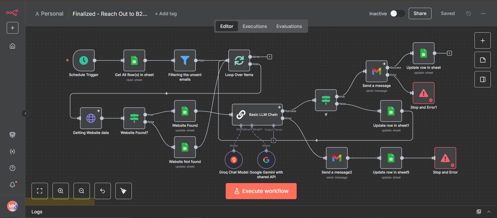

# B2B AI Outreach Automation using n8n, Gemini AI, Gmail, and Google Sheets

This open-source **n8n workflow** automates personalized B2B outreach emails by integrating **Gemini AI**, **Gmail**, and **Google Sheets**.  
It reads leads from a Google Sheet, generates customized cold emails with AI, sends them via Gmail, and logs all activity back into the same sheet.

---

## Overview

**Workflow Name:** Reach Out to B2B Leads with Gemini AI, Gmail & Sheets  
**Platform:** [n8n.io](https://n8n.io)

This automation:
1. Reads B2B leads from a connected Google Sheet.  
2. Filters out leads that already have an email status.  
3. Uses **Gemini AI (via LangChain)** to generate a personalized cold email.  
4. Sends the email using Gmail.  
5. Updates the Google Sheet with:
   - Status (SENT / FAILED)
   - Subject line
   - Timestamp
   - AI generation errors (if any)
6. Sends alert emails when an AI or send error occurs.

---

# B2B AI Outreach Automation using n8n, Gemini AI, Gmail, and Google Sheets

Automates personalized B2B outreach emails using n8n, Gemini AI, Gmail, and Google Sheets.  
It reads leads from Google Sheets, generates AI-crafted cold emails, sends them via Gmail, and updates all data automatically.

---

## Workflow Components

| Step | Node | Description |
|------|------|--------------|
| 1 | **Google Sheets: Read** | Fetches all B2B leads |
| 2 | **Filter Node** | Filters out rows with existing email status |
| 3 | **LLM Chain (Gemini AI)** | Generates a cold email (subject + message) |
| 4 | **If Node** | Checks if the email should be sent |
| 5 | **Gmail Node** | Sends the email to the lead |
| 6 | **Google Sheets: Update** | Logs results back to the sheet |
| 7 | **Error Handler** | Sends alert emails if generation or send fails |

---

## Prerequisites

Before running the workflow, ensure you have:
- **n8n** installed (v1.75.0 or newer) or Self Hosted on a VPS 
- **Google Sheets API** credentials (OAuth2)
- **Gmail API** credentials (OAuth2)
- **Gemini AI access** integrated via LangChain

---

## Setup Instructions

1. **Import the Workflow**
   - In n8n, click **Import Workflow** and select the provided JSON file.

2. **Configure Credentials**
   - Connect your Google Sheets, Gmail, and Gemini AI accounts.

3. **Adjust Google Sheet Parameters**
   - Ensure your sheet includes columns for name, company, email, and email status.

4. **Run the Workflow**
   - Execute manually or schedule it with a Cron trigger for periodic runs.

5. **Review Logs**
   - Check the Google Sheet for updated statuses and timestamps.

---

## Data Columns in Google Sheets

| Column | Purpose |
|--------|----------|
| First Name | Personalization |
| Company Name | Used in AI prompt |
| Email (n8n) | Recipient email |
| Web Address | For context generation |
| Email Status | SENT / FAILED |
| Subject Line Sent | Stores AI-generated subject |
| Failure on llm model | Logs AI generation errors |
| Time | Timestamp of the email sent |

---

## Example Use Cases

- Automating cold email outreach for sales or partnerships  
- Personalized lead engagement using AI  
- CRM workflow integration via n8n  

---

## Developer

**Developed and maintained by:** Muizz Khan  
📧 **Email:** [muizztalks@gmail.com](mailto:muizztalks@gmail.com)

---

## License

MIT License  
Copyright (c) 2025 Muizz Khan  

Permission is hereby granted, free of charge, to any person obtaining a copy  
of this software and associated documentation files (the "Software"), to deal  
in the Software without restriction, including without limitation the rights  
to use, copy, modify, merge, publish, distribute, sublicense, and/or sell  
copies of the Software, and to permit persons to whom the Software is  
furnished to do so, subject to the following conditions:

The above copyright notice and this permission notice shall be included in  
all copies or substantial portions of the Software.

THE SOFTWARE IS PROVIDED "AS IS", WITHOUT WARRANTY OF ANY KIND, EXPRESS OR  
IMPLIED, INCLUDING BUT NOT LIMITED TO THE WARRANTIES OF MERCHANTABILITY,  
FITNESS FOR A PARTICULAR PURPOSE AND NONINFRINGEMENT. IN NO EVENT SHALL THE  
AUTHORS OR COPYRIGHT HOLDERS BE LIABLE FOR ANY CLAIM, DAMAGES OR OTHER  
LIABILITY, WHETHER IN AN ACTION OF CONTRACT, TORT OR OTHERWISE, ARISING FROM,  
OUT OF OR IN CONNECTION WITH THE SOFTWARE OR THE USE OR OTHER DEALINGS IN  
THE SOFTWARE.
